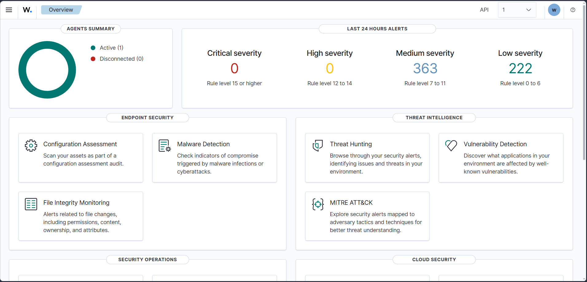
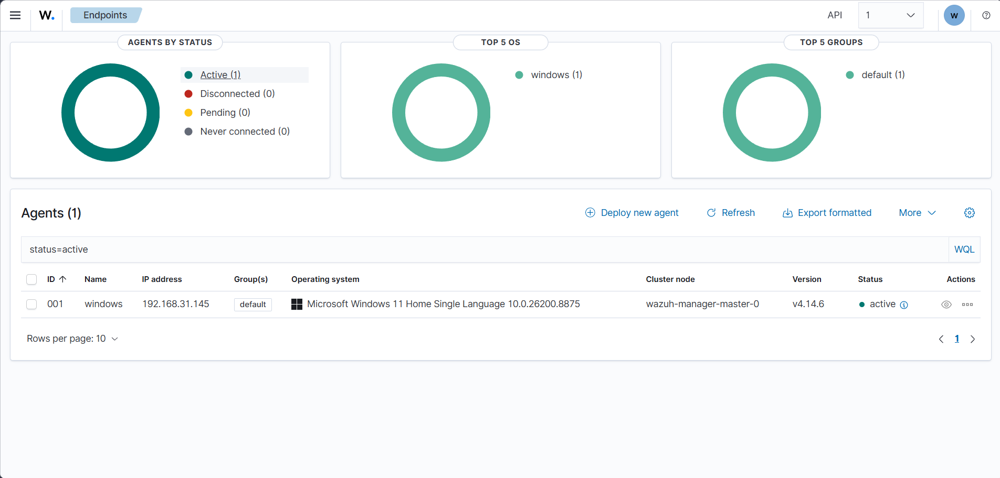
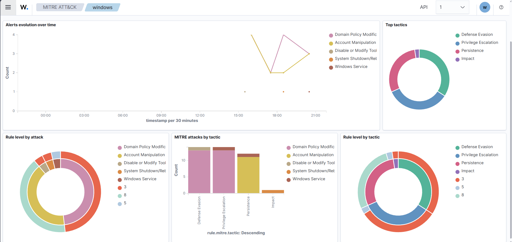
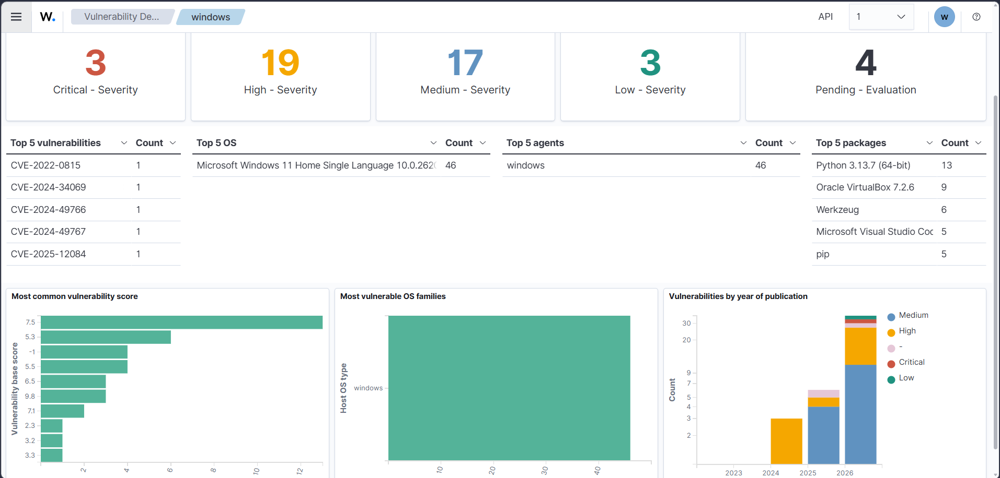
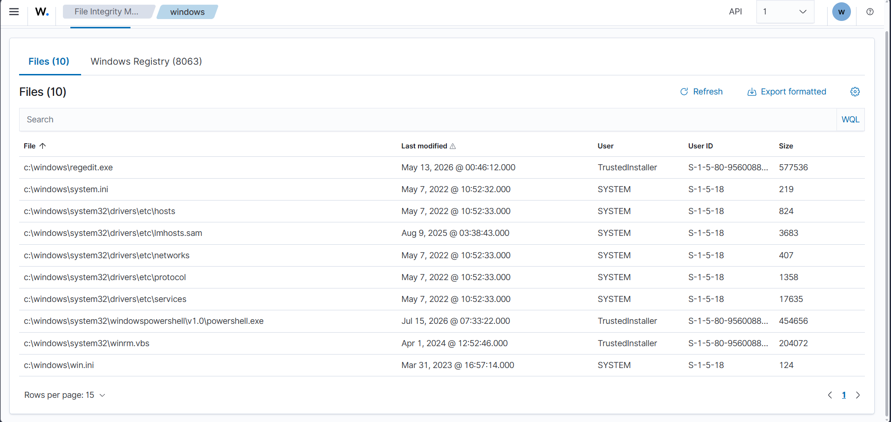

# Wazuh Cloud SIEM Home Lab

## Overview

This project demonstrates the deployment of a Windows endpoint into Wazuh Cloud using the Wazuh Agent.

The objective of this lab was to understand how Security Information and Event Management (SIEM) solutions collect endpoint telemetry, monitor security events, and assist Security Operations Center (SOC) analysts during investigations.

---

## Lab Architecture

Windows 11 Endpoint
        │
        │
   Wazuh Agent
        │
        ▼
 Wazuh Cloud Platform
        │
        ▼
 Dashboard
        │
        ▼
 Alert Analysis

---

## Technologies Used

- Wazuh Cloud
- Windows 11
- PowerShell
- Wazuh Agent

---

## Features Tested

- Agent Enrollment
- Security Event Monitoring
- Endpoint Inventory
- Vulnerability Detection
- MITRE ATT&CK Mapping
- Dashboard Navigation

---

## Skills Demonstrated

- SIEM Fundamentals
- Endpoint Monitoring
- Security Event Analysis
- Windows Logging
- Threat Detection

---

## Future Improvements

- Add Linux Endpoint
- Configure Sysmon
- Custom Detection Rules
- Active Response
- Attack Simulation

---

## Documentation

For detailed project documentation, see [Documentation.md](Documentation.md).

---

## Scripts

The `Scripts` folder contains the PowerShell script used to install and register the Wazuh Agent on the Windows endpoint.

- `install-wazuh-agent.ps1` – Wazuh Agent installation script (sanitized for public release).

---

## 📸 Screenshots

### 1. Wazuh Dashboard

---

### 2. Endpoint Agents Dashboard

---

### 3. MITRE ATT&CK Dashboard

---

### 4. Vulnerability Dashboard

---

### 5. File Integrity Monitoring (FIM)

